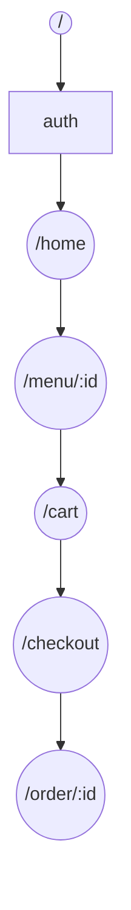

# Sinful Delights – **Flutter Repository** Design Document

> **Status** Draft v0.2 • July 19 2025

This document narrows the broader technical design to the **Flutter codebase only**—everything contained in the `sinful_delights_mobile/` monorepo. It covers folder layout, package choices, build scripts, CI, code-quality gates, and app-layer boundaries. Backend infra (AWS Lambda, Dynamo, Stripe) is treated as an external service accessed via REST.

---

## 1 Purpose
Provide a single reference that lets any engineer clone the Flutter repo, understand the architecture, and contribute features or bug-fixes with confidence.

---

## 2 Repository Layout
```text
sinful_delights_mobile/
├── lib/
│   ├── core/          # Cross-cutting utils (env, analytics, exceptions)
│   ├── features/
│   │   ├── auth/
│   │   ├── menu/
│   │   ├── cart/
│   │   ├── subscription/
│   │   ├── catering/
│   │   └── admin/
│   ├── l10n/          # ARB localization files
│   └── main.dart
├── test/              # Pure Dart & widget tests (mirrors lib/)
├── integration_test/  # E2E driver tests
├── web/               # Flutter-web wrapper (index.html, flutter.js)
├── android/           # Generated by flutter create (keystore in CI)
├── ios/
├── macos/             # For future desktop support (optional)
├── pubspec.yaml
└── melos.yaml         # Workspace tool for future packages
```

*We version-control **only** generated iOS/Android signing configs required for CI. Builds for production use CI-injected keystores/certificates.*

### 2.1 Feature Folder Anatomy (example)
```text
menu/
├── data/
│   ├── menu_api.dart         # Dio calls
│   ├── menu_repository.dart  # Business logic & caching
│   └── models/
│       └── menu.dart
├── domain/
│   └── usecases.dart         # Pure functions if needed
├── presentation/
│   ├── controllers/          # Riverpod Notifiers
│   ├── widgets/
│   └── screens/
└── menu_route.dart           # GoRouter sub-branch
```

---

## 3 Key Packages
| Concern | Package | Rationale |
| ------- | ------- | --------- |
| **State Management** | `riverpod` 2 / `flutter_riverpod` | Compile-safe providers, granular rebuilds |
| **Navigation** | `go_router` | Nested navigation + web URL sync |
| **Networking** | `dio`, `dio_http2_adapter` | Interceptors, cancel tokens, retry |
| **JSON** | `json_serializable`, `freezed` | Immutable models, sealed unions |
| **Payments** | `flutter_stripe` | Single SDK for web + mobile |
| **Analytics** | `firebase_analytics` | Stream events to BigQuery |
| **Push** | `firebase_messaging` | Handles background FCM |
| **DI** | `riverpod` (built-in) | Avoids 3rd-party IoC |
| **Env** | `flutter_dotenv` | `.env.development`, `.env.production` |
| **Testing** | `mocktail`, `golden_toolkit` | Mocking + golden tests |
| **Linting** | `very_good_analysis` + `custom_analysis.yaml` | Enforce style |

---

## 4 Architecture Overview
```mermaid
flowchart TD
  UI[Flutter Widgets]
  UI --> Controllers[Riverpod Notifiers]
  Controllers --> Repos[Feature Repositories]
  Repos --> DataSources[RemoteDataSources (Dio)]
  Repos --> Cache[Hive / In-Memory]
  DataSources -->|HTTP JSON| API[REST Endpoints]
```

* **Clean-ish layering** (Presentation → Application/Domain → Data) while keeping pragmatic.  
* **Repositories** abstract remote vs local cache; unit-testable via mock data source.  
* **Controllers** expose immutable `AsyncValue<T>` to widgets—screens subscribe via `ref.watch()`.

### 4.1 Error Handling
```dart
sealed class Failure {
  const Failure();
}
class NetworkFailure extends Failure {}
class AuthFailure extends Failure {}
```
* Repositories return `Result<T, Failure>` to bubble typed failures.  
* Global `ErrorLogger` funnels uncaught exceptions to Crashlytics.

### 4.2 Offline Caching (Phase 2)
* Use **Hive** boxes (`menuBox`, `cartBox`).  
* `menuRepository.getTodayMenu()` falls back to cache when offline.

---

## 5 Networking & Environment Config
### 5.1 Base Client
```dart
final dio = Dio(
  BaseOptions(
    baseUrl: Env.config.apiBaseUrl,
    headers: {'X-API-Key': Env.config.publicApiKey},
  ),
)
  ..interceptors.addAll([
    AuthTokenInterceptor(),   // Adds Firebase ID token when available
    RetryOnSocketException(), // 0.5s – 1s – 2s back-off
    LogInterceptor(),         // printf in debug
  ]);
```
* **AuthTokenInterceptor** subscribes to `firebaseAuth.idTokenChanges()`.  
* SSL pinned certificates optional (mobile only).

### 5.2 Per-Environment `.env` Files
```
API_BASE_URL=https://api-dev.sinfuldelights.com/v1
PUBLIC_API_KEY=xxx-dev
STRIPE_PUBLISHABLE_KEY=pk_test_...
```
`flutter build` selects env via `--dart-define=ENV=production`.

---

## 6 Theming & Design System
* Source of truth: `theme.dart` exporting `SinfulTheme.dark()` + `SinfulTheme.light()` (future).  
* Colour tokens:  
  * **Primary Crimson** `Color(0xFF8B0000)`  
  * **Surface Dark** `Color(0xFF1A1A1A)`  
  * **Accent Gray** `Color(0xFF7A7A7A)`  
* Typography: Inter font, sizes via M3 spec.  
* Components use `radius: 24` (`rounded-2xl`) and `elevation: 2` (soft shadow).

---

## 7 Routing Graph (Customer)


Admin routes live under `/admin/...` and guard via `role` claim in ID token.

---

## 8 Testing Strategy
| Layer | Tooling | Notes |
| ----- | ------- | ----- |
| **Unit** | `flutter_test`, `mocktail` | Repositories, controllers |
| **Widget** | `flutter_test` + golden toolkit | Resize at 375×812 & 1024×768 |
| **Integration** | `integration_test` + `flutter_driver` | Runs on Firebase Test Lab for PRs |
| **Contract** | `pact_dart` (future) | Ensure API remains backward compatible |

CI gate requires **100 % unit tests pass** + **≥ 90 % line coverage** on critical packages.

---

## 9 Continuous Integration (GitHub Actions)
```yaml
name: CI
on:
  pull_request:
    branches: [ main ]
jobs:
  test:
    runs-on: ubuntu-latest
    steps:
      - uses: actions/checkout@v4
      - uses: subosito/flutter-action@v2
        with: { flutter-version: "3.22.0" }
      - run: flutter pub get
      - run: flutter test --coverage
      - run: flutter analyze --no-pub --fatal-infos
  build_web:
    if: github.event_name == 'push' && github.ref == 'refs/heads/main'
    runs-on: ubuntu-latest
    steps:
      - uses: actions/checkout@v4
      - uses: subosito/flutter-action@v2
        with: { flutter-version: "3.22.0" }
      - run: flutter pub get
      - run: flutter build web --dart-define-from-file=.env.production.json
      - uses: aws-actions/configure-aws-credentials@v4
        with: { role-to-assume: ${{ secrets.AWS_ROLE }}, aws-region: us-east-1 }
      - run: aws s3 sync build/web s3://sinfuldelights-web --delete
```
* Mobile build & store deploy handled by **Fastlane** job (`android_build`, `ios_build`).

---

## 10 Code Quality & Style
* **Very Good Analysis** rules + _custom overrides_: no wildcard imports, prefer const constructors.  
* Pre-commit hook via **`pre-commit`** runs `dart format` and `flutter analyze`.  
* PR template requires:
  * Linked JIRA ticket.  
  * Checklist for tests, docs, screenshots.

---

## 11 Accessibility & Intl
* `MediaQuery.textScaleFactor` tested up to 2.0.  
* `Semantics` labels on actionable icons.  
* ARB files for future i18n; English copy in `intl_en.arb`.

---

## 12 Open Questions
1. **Offline Mode** – Keep Hive caching in MVP or behind a feature flag?  
2. **Melos** – Do we split features into packages for modular builds?  
3. **Web SEO** – Do we need prerendering for public menu pages? (Flutter Web)  
4. **Desktop** – Is macOS/Windows build in 2026 roadmap?

---

### Next Steps
* Decide on offline caching scope.  
* Approve CI pipeline YAML or share preferred CI vendor.  
* Provide logo SVGs to generate adaptive launcher icons.
